<div lang="fa" dir="rtl" align="right">

# 👑 نرم‌افزار مدیریت جامع و سلطنتی گوشی‌های هوشمند — CellPhoneManager v3.2.0 Royal Edition

[-d4af37?style=for-the-badge&logo=android)](https://irres.ir)
[](https://github.com/taimazus/CellPhoneManager)
[](https://github.com/taimazus/CellPhoneManager)
[](LICENSE)
[-blue?style=for-the-badge&logo=windows)](https://irres.ir)
[](https://irres.ir)

<div align="center">
  
  <p><em>طراحی و توسعه اختصاصی توسط <strong>شرکت راهکار الکترونیک سهند</strong> (<a href="https://irres.ir">https://irres.ir</a>)</em></p>
  <p><strong><a href="README.md">🇬🇧 For English Documentation Click Here</a></strong></p>
</div>

---

## 📌 معرفی نرم‌افزار

**CellPhoneManager v3.2.0 Royal Edition** یک نرم‌افزار مدرن، پرسرعت، همه‌منظوره و با طراحی سلطنتی طلایی و آبسیدین برای رایانه‌های ویندوزی است که گوشی شما (اندروید با هر برندی یا آیفون) را به کامپیوتر متصل کرده و امکاناتی بی‌نظیر را فراهم می‌سازد:

* **🔊 بلندگوی کامپیوتر روی گوشی (PC Speaker Mode):** استریم زنده صدای سیستم به گوشی با تاخیر نزدیک به صفر روی کابل USB یا Wi-Fi به همراه وب‌پلیر اختصاصی و اکولایزر بصری بدون نیاز به نصب نرم‌افزار اضافی.
* **📱 موتور هوشمند چندبرندی (Multi-OEM Resolver):** سازگاری خودکار با تمامی پوسته‌های شیائومی (HyperOS / MIUI)، سامسونگ (One UI)، هواوی (EMUI)، اوپو و گوگل پیکسل.
* **📦 پشتیبان‌گیری و بازیابی جامع (Universal Backup & Restore):** بکاپ کامل با ۱ کلیک یا سفارشی از مخاطبین (vCard + JSON)، پیامک‌ها، تماس‌ها، عکس‌های دوربین و برنامه‌ها با ذخیره در کامپیوتر یا کارت حافظه گوشی.
* **🩺 پزشک سیستم و پاکسازی عمیق (System Doctor & Deep Cleaner):** اسکن و آزادسازی گیگابایت‌ها حافظه کش پنهان، فایل‌های موقت، بندانگشتی‌ها و ابزارهای تعمیر خودکار (DNS Turbo، کالیبراسیون باتری و راه‌اندازی گرافیک).
* **🎥 استودیو ضبط صفحه و صدا 60fps با انکودر سخت‌افزاری:** ضبط ویدیوهای فوق روان با صدای داخلی و پخش فوری در پلیر درون‌برنامه‌ای با پشتیبانی کامل از Windows Media Player.
* **🔬 آزمایشگاه تست جامع سخت‌افزار (Hardware Lab Suite):** آزمون لرزش هپتیک (۶ الگو)، سنتز فرکانس صوتی (۱۲۰ تا ۸۰۰۰ هرتز)، تست تمام‌صفحه پیکسل‌های سوخته، دکمه‌های فیزیکی و مانیتورینگ زنده ۲۳+ سنسور.
* **👑 تم سلطنتی (Imperial Charcoal & Royal Gold):** پالت رنگی لوکس زغالی تیره و طلایی ۲۴ عیار در تمام صفحات و کارت‌ها.
* **📖 مرکز آموزش و راهنمای تعاملی درون‌برنامه‌ای:** راهنمای ۱۱ سرفصل گام‌به‌گام با جستجوی هوشمند و کارت‌های آموزشی در تمام تب‌ها.

---

## 🗺️ دیاگرام روابط و معماری نرم‌افزار

```mermaid
graph TD
    A[CellPhoneManager v3.2 Royal Edition] --> B[کنترل، تصویر و مالتی‌دیوایس]
    A --> C[استودیو روت، فلش و بازیابی]
    A --> D[پشتیبان‌گیری و انتقال فرامرزی]
    A --> E[تبدیل گوشی به سخت‌افزار جانبی]
    A --> F[پزشک سیستم و پاکسازی فایل‌ها]
    A --> G[آزمایشگاه تست سخت‌افزار]
    A --> H[صندوق رمزها و امنیت]

    B --> B1[استریم زنده داخل وب و وب‌کم]
    B --> B2[موتور Scrcpy با نرخ ۶۰ فریم]
    B --> B3[ضبط سخت‌افزاری MP4 با پلیر داخلی]

    C --> C1[روت امن با Magisk 27 و KernelSU]
    C --> C2[بوت تستی فست‌بوت بدون خطر بریک]
    C --> C3[فلش رام‌های کاستوم LineageOS و GSI]

    D --> D1[پشتیبان‌گیری کامل ۱ کلیکی یا سفارشی]
    D --> D2[ذخیره روی هارد PC یا حافظه گوشی]
    D --> D3[خروجی استاندارد جهانی vCard 3.0]

    E --> E1[وب‌کم 4K و میکروفون با نویزگیر]
    E --> E2[بلندگوی کامپیوتر روی گوشی PC Speaker Mode]
    E --> E3[دسته بازی و ماوس مجازی]

    F --> F1[پاکسازی کش پنهان و Temp APKs]
    F --> F2[تعمیر DNS و شتاب اینترنت]
    F --> F3[حذف تبلیغات سیستمی Debloater]

    G --> G1[تست هپتیک و ۶ الگوی ویبره]
    G --> G2[تست فرکانس صوتی و Sweep]
    G --> G3[تست تمام‌صفحه پیکسل سوخته RGB]
    G --> G4[مانیتورینگ زنده ۲۳+ سنسور]

    H --> H1[استخراج رمزهای ذخیره وای‌فای]
    H --> H2[امداد قفل صفحه و نجات اطلاعات]
```



---

## 🚀 راهنمای دانلود و اجرای سریع (۳ ثانیه‌ای)

### روش اول: دانلود با Git (پیشنهادی)
```bash
# ۱. دریافت آخرین نسخه از مخزن گیت‌هاب
git clone https://github.com/taimazus/CellPhoneManager.git

# ۲. ورود به پوشه پروژه
cd CellPhoneManager

# ۳. اجرای لانچر خودکار
cpmStart.bat
```

### روش دوم: دانلود فایل فشرده ZIP
1. از بالای همین صفحه روی دکمه سبز رنگ **Code** کلیک کرده و **Download ZIP** را انتخاب کنید.
2. فایل را استخراج (Extract) کرده و روی **`cpmStart.bat`** دابل کلیک نمایید.
3. راه‌انداز خودکار تمامی وابستگی‌ها و ابزارهای لازم را پیکربندی کرده و محیط وب‌اپلیکیشن را در مرورگر شما باز می‌کند.

---

## 📱 نحوه فعال‌سازی اتصال گوشی (USB Debugging)

### گوشی‌های اندروید (شیائومی، سامسونگ، هواوی، پیکسل، اوپو):
1. در گوشی وارد **تنظیمات (Settings)** > **درباره تلفن (About Phone)** شوید.
2. روی **شماره ساخت (Build Number)** یا نسخه **MIUI / HyperOS** هفت مرتبه متوالی ضربه بزنید.
3. وارد **گزینه‌های توسعه‌دهنده (Developer Options)** شوید و گزینه **اشکال‌زدایی USB (USB Debugging)** را فعال کنید.
4. در گوشی‌های شیائومی، گزینه‌های **Install via USB** و **USB Debugging (Security Settings)** را نیز روشن کنید.
5. پس از اتصال کابل، در پیام روی صفحه گوشی گزینه **Always allow** را تیک زده و **OK** نمایید.

### گوشی‌های اپل آیفون و آیپد (iOS):
* گوشی را با کابل متصل کرده و در پیام نمایش داده شده روی صفحه آیفون دکمه **Trust** را بزنید و رمز عبور را وارد کنید.

---

## 🛠️ جعبه ابزار و تب‌های اختصاصی برنامه

| ردیف | نام تب | قابلیت‌ها و امکانات |
| :--- | :--- | :--- |
| ۱ | **داشبورد و وضعیت** | نمایش تلمتری زنده باتری، مدل سخت‌افزار، سلامت شبکه، اسکرین‌شات و میانبرهای سیستم |
| ۲ | **دستیار هوش مصنوعی** | پزشک هوشمند جهت تحلیل خرابی‌ها، کاهش لگ و پاسخ به سوالات تخصصی گوشی |
| ۳ | **نمایش و کنترل زنده** | کنترل صفحه لمسی با ماوس و کیبورد با نرخ ۶۰ فریم داخل مرورگر و Scrcpy |
| ۴ | **پشتیبان‌گیری و بازیابی جامع** | بکاپ کامل و انتخابی روی کامپیوتر یا کارت SD گوشی و بازیابی مستقیم مخاطبین و پیامک‌ها |
| ۵ | **پزشک سیستم و پاکسازی** | اسکن فایل‌های زائد، پاکسازی کش، تعمیر دسترسی‌ها، کالیبراسیون باتری و DNS Turbo |
| ۶ | **آزمایشگاه تست سخت‌افزار** | تست موتور هپتیک، فرکانس‌های ۱۲۰Hz-۸kHz، نمایشگر پیکسل سوخته، دکمه‌ها و سنسورها |
| ۷ | **استودیو صدا و بلندگوی PC** | استریم زنده صدای سیستم روی گوشی، تقویت بلندی صدا تا ۲۰۰٪ و پخش استریو |
| ۸ | **مدیریت برنامه‌ها و APK/IPA** | نصب مستقیم فایل نصبی، حذف دسته‌جمعی، فریز و استخراج APK و IPA با یک کلیک |
| ۹ | **ضبط صفحه و صدا 60fps** | فیلم‌برداری سخت‌افزاری با صدای داخلی با فرمت MP4 و پخش زنده در پلیر داخلی |
| ۱۰ | **حذف تبلیغات سیستمی** | پاکسازی امن سرویس‌های تبلیغاتی شیائومی، سامسونگ و گوگل بدون نیاز به روت |
| ۱۱ | **صندوق رمز و وای‌فای** | استخراج پسوردهای ذخیره‌شده شبکه‌های Wi-Fi و پشتیبان‌گیری از گذرواژه‌ها |
| ۱۲ | **امداد قفل صفحه و نجات** | راه‌اندازی اضطراری Safe Mode، بازگشایی قفل در صورت فراموشی و ریکاوری داده‌ها |
| ۱۳ | **روت و آن‌روت کامل** | پچ خودکار با Magisk 27، تست بوت موقت در فست‌بوت و حذف کامل روت با ۱ کلیک |
| ۱۴ | **فلش رام و آپدیت OS** | نصب رسمی رام‌های کارخانه، LineageOS، رام‌های عمومی GSI و ارتقای نرم‌افزاری |
| ۱۵ | **اشتراک اینترنت و VPN** | انتقال فیلترشکن فعال گوشی به کامپیوتر و اتصال پرسرعت اینترنت USB Tethering |
| ۱۶ | **استودیو وب‌کم و میکروفون** | تبدیل دوربین گوشی به وب‌کم باکیفیت 4K و میکروفون کامپیوتر با سیستم حذف نویز |

---

## 🏢 توسعه‌دهنده و پشتیبانی

* **توسعه‌دهنده:** شرکت راهکار الکترونیک سهند (Sahand Electronic Solutions Co.)
* **وب‌سایت رسمی:** [https://irres.ir](https://irres.ir)
* **مخزن گیت‌هاب:** [https://github.com/taimazus/CellPhoneManager](https://github.com/taimazus/CellPhoneManager)
* **مجوز:** MIT Open Source License

</div>
