```mermaid
graph TD
    A[CellPhoneManager v3.0] --> B[کنترل، تصویر و مالتی‌دیوایس]
    A --> C[استودیو روت، فلش و بازیابی]
    A --> D[پشتیبان‌گیری و انتقال فرامرزی]
    A --> E[تبدیل گوشی به سخت‌افزار جانبی]
    A --> F[شبکه، تترینگ و انتقال VPN]
    A --> G[صندوق رمزها، امنیت و آنالیز]

    B --> B1[استریم زنده داخل وب و وب‌کم]
    B --> B2[موتور Scrcpy با نرخ ۶۰ فریم]
    B --> B3[کنترل همزمان مزرعه گوشی‌ها]

    C --> C1[روت امن با Magisk 27 و KernelSU]
    C --> C2[بوت تستی فست‌بوت بدون خطر بریک]
    C --> C3[آن‌روت کامل با ۱ کلیک و بازگشت OTA]
    C --> C4[فلش رام‌های کاستوم LineageOS و GSI]

    D --> D1[پشتیبان‌گیری استاندارد vCard و JSON]
    D --> D2[بازیابی مستقیم بین اندروید و آیفون]
    D --> D3[استخراج فایل APK و تایپ مستقیم]

    E --> E1[تبدیل به وب‌کم 4K برای Zoom و OBS]
    E --> E2[تبدیل به میکروفون کامپیوتر با تاخیر کم]
    E --> E3[دسته بازی و تاچ‌پد مجازی PC]

    F --> F1[اتصال سریع اینترنت با کابل USB Tethering]
    F --> F2[انتقال تونل فیلترشکن گوشی به ویندوز]

    G --> G1[مشاهده رمزهای ذخیره‌شده وای‌فای]
    G --> G2[امداد قفل صفحه و وایپ اضطراری]
    G --> G3[آنالایزر امنیتی و ریسک دسترسی APK]
```

<div lang="fa" dir="rtl" align="right">

# 📱 نرم‌افزار مدیریت جامع گوشی‌های هوشمند — CellPhoneManager v3.0

[-00f0ff?style=for-the-badge&logo=android)](https://irres.ir)
[](https://github.com/taimazus/CellPhoneManager)
[](LICENSE)
[-blue?style=for-the-badge&logo=windows)](https://irres.ir)
[](https://irres.ir)

<div align="center">
  
  <p><em>محصول تخصصی <strong>شرکت راهکار الکترونیک سهند</strong> (<a href="https://irres.ir">https://irres.ir</a>)</em></p>
  <p><strong><a href="README.md">🇬🇧 For English Documentation Click Here</a></strong></p>
</div>

---

## 📌 معرفی نرم‌افزار

**CellPhoneManager v3.0** یک نرم‌افزار مدرن، پرسرعت و بدون دردسر برای کامپیوترهای ویندوزی است که گوشی شما (اندروید یا آیفون) را به کامپیوتر متصل کرده و امکاناتی بی‌نظیر مانند کنترل زنده صفحه، روت و آن‌روت ایمن، فلش انواع رام‌ها، پشتیبان‌گیری کامل، استخراج رمزهای وای‌فای، اشتراک فیلترشکن گوشی به سیستم و تبدیل گوشی به وب‌کم و میکروفون را در اختیارتان قرار می‌دهد.

---

## 🗺️ دیاگرام روابط و معماری نرم‌افزار



---

## 🚀 راهنمای دانلود و نصب آسان از GitHub (گام به گام)

### روش اول: دانلود مستقیم با Git (سریع‌ترین روش)
اگر برنامه Git روی ویندوز شما نصب است، دستورات زیر را در CMD یا PowerShell وارد کنید:

```bash
# ۱. دانلود پروژه از مخزن رسمی گیت‌هاب
git clone https://github.com/taimazus/CellPhoneManager.git

# ۲. ورود به پوشه برنامه
cd CellPhoneManager

# ۳. اجرای راه‌انداز خودکار
cpmStart.bat
```

---

### روش دوم: دانلود فایل فشرده ZIP از وب‌سایت GitHub
۱. به صفحه گیت‌هاب پروژه به آدرس **[github.com/taimazus/CellPhoneManager](https://github.com/taimazus/CellPhoneManager)** بروید.  
۲. روی دکمه سبز رنگ **Code** کلیک کرده و گزینه **Download ZIP** را انتخاب کنید.  
۳. فایل فشرده دانلود شده را از حالت فشرده (Extract) خارج کنید.  
۴. داخل پوشه، روی فایل **`cpmStart.bat`** دابل کلیک کنید.

> 💡 **راه‌انداز هوشمند (`cpmStart.bat`):**
> - بررسی و نصب خودکار موتور اجرایی `Node.js` در صورت عدم وجود.
> - دانلود و نصب هوشمند بسته‌ها و اجرای تست سلامت ابزارها (ADB, Scrcpy, Fastboot, idevice).
> - **قابلیت اجرا از همه‌جا (PATH):** با اجرای دستور `cpmStart.bat --add-path` در ترمینال یا کپی فایل به پوشه ویندوز، از این پس در هر محیطی (CMD، PowerShell، پنجره Run کلیدهای `Win + R`) فقط با نوشتن **`cpmstart`** برنامه در کسری از ثانیه اجرا می‌شود.

---

## 📱 نحوه اتصال گوشی به سیستم (بسیار ساده در ۳ مرحله)

### برای گوشی‌های اندروید (سامسونگ، شیائومی، هواوی، پیکسل و...):
1. در گوشی وارد **تنظیمات (Settings)** > **درباره تلفن (About Phone)** شوید.
2. روی گزینه **شماره ساخت (Build Number)** یا نسخه MIUI / HyperOS هفت بار ضربه بزنید تا پیام "شما اکنون یک توسعه‌دهنده هستید" ظاهر شود.
3. به مسیر **تنظیمات اضافی (Developer Options)** رفته و گزینه **اشکال‌زدایی USB (USB Debugging)** را روشن کنید.
4. گوشی را با کابل به کامپیوتر متصل کنید و وقتی روی صفحه گوشی پیامی آمد، تیک گزینه **Always allow** را زده و **OK** کنید.

### برای گوشی‌های آیفون (Apple iOS):
- آیفون را با کابل لایتنینگ/تایپ‌سی به کامپیوتر متصل کرده و در پیام ظاهر شده روی صفحه گوشی، گزینه **Trust This Computer** را لمس کرده و رمز گوشی را وارد کنید.

---

## 🎯 راهنمای کار با بخش‌های کاربردی نرم‌افزار

| عنوان تب در برنامه | کاربرد ساده برای کاربر |
|---|---|
| 🖥️ **نمایش و کنترل زنده** | دیدن صفحه گوشی روی کامپیوتر با ماوس و کیبورد، بدون هیچ تاخیری |
| 🌐 **اشتراک اینترنت و VPN** | انتقال فیلترشکن فعال گوشی به کامپیوتر تا تلگرام و برنامه‌های PC بدون فیلتر کار کنند |
| 📦 **پشتیبان‌گیری و بازیابی** | گرفتن نسخه پشتیبان کامل از مخاطبین و پیامک‌ها و انتقال آن به گوشی دیگر |
| 🔑 **صندوق رمز و وای‌فای** | دیدن پسورد واقعی وای‌فای‌هایی که به آن‌ها وصل شده‌اید و کپی آسان آن‌ها |
| 📸 **استودیو و وب‌کم دوربین** | تبدیل دوربین باکیفیت گوشی به وب‌کم برای برنامه‌هایی مثل Zoom و OBS |
| 🎙️ **میکروفون کامپیوتر** | استفاده از میکروفون گوشی به عنوان میکروفون کامپیوتر برای بازی و تماس صوتی |
| 🔥 **روت و آن‌روت کامل** | روت کردن آزمایشی و مطمئن یا پاکسازی کامل روت برای برنامه‌های بانکی |
| ⚡ **فلش رام و آپدیت OS** | ارتقای سیستم‌عامل، نصب LineageOS و آپدیت‌های رسمی بدون دردسر |
| 🗑️ **حذف تبلیغات سیستمی** | پاکسازی برنامه‌های پیش‌فرض مزاحم شیائومی و سامسونگ با ۱ کلیک |

---

## 🛑 نحوه توقف (Stop) و راه‌اندازی مجدد (Restart) برنامه

برای مدیریت سریع سرورهای برنامه سه روش بسیار ساده در نظر گرفته شده است:

### روش ۱: استفاده از اسکریپت‌های اختصاصی (سریع‌ترین)
- **برای توقف برنامه (Stop):** روی فایل **`cpmStop.bat`** دابل‌کلیک کنید یا در ترمینال دستور `cpmstop` را بنویسید. این کار بلافاصله تمام پردازه‌ها و پورت‌های ۳۰۰۱ و ۵۱۷۳ را آزاد می‌کند.
- **برای راه‌اندازی مجدد (Restart):** روی فایل **`cpmRestart.bat`** دابل‌کلیک کنید یا در ترمینال دستور `cpmrestart` را بنویسید.

### روش ۲: از طریق دستورات ترمینال
```cmd
cpmstart --stop       # توقف کلیه سرویس‌ها
cpmstart --restart    # ری‌استارت کامل و بالا آمدن مجدد برنامه
```

### روش ۳: میانبر کیبورد در پنجره باز برنامه
- در همان پنجره سیاه رنگ که برنامه را اجرا کرده‌اید، کلیدهای **`Ctrl + C`** را فشار داده و سپس حرف `Y` و اینتر را بزنید.

---

## 🗑️ راهنمای حذف کامل برنامه از سیستم (Uninstallation)

اگر روزی تصمیم گرفتید برنامه را از روی کامپیوتر خود به طور کامل حذف کنید:

1. **بستن برنامه:** پنجره سیاه ترمینال برنامه را با زدن `Ctrl + C` یا بستن ضربدر پنجره ببندید.
2. **توقف سرویس ADB در پس‌زمینه (اختیاری):** کلیدهای `Win + R` را بزنید، تایپ کنید `cmd` و اینتر را فشار دهید، سپس دستور زیر را بزنید:
   ```cmd
   taskkill /F /IM adb.exe
   ```
3. **حذف پوشه برنامه:** کافیست کل پوشه `CellPhoneManager` را انتخاب کرده و دکمه **Delete** کیبورد را فشار دهید.
4. هیچ فایل پنهان یا رجیستری مخربی در ویندوز باقی نخواهد ماند و سیستم شما کاملاً پاک خواهد شد.

---

## 🏢 درباره شرکت راهکار الکترونیک سهند

این نرم‌افزار توسط **شرکت راهکار الکترونیک سهند** جهت استفاده عموم و ارتقای ابزارهای مدیریت سخت‌افزار طراحی و منتشر شده است.

- 🌐 **وب‌سایت رسمی:** [https://irres.ir](https://irres.ir)
- 📍 **مخزن رسمی گیت‌هاب:** [https://github.com/taimazus/CellPhoneManager](https://github.com/taimazus/CellPhoneManager)
- ✉️ **ایمیل پشتیبانی:** [info@irres.ir](mailto:info@irres.ir)

---

## 📜 لایسنس
این پروژه به صورت متن‌باز تحت مجوز **MIT License** منتشر شده است.

</div>
