<div lang="fa" dir="rtl" align="right">

# 📱 نرم‌افزار مدیریت جامع گوشی‌های هوشمند — CellPhoneManager v3.0

[-00f0ff?style=for-the-badge&logo=android)](https://irres.ir)
[](LICENSE)
[-blue?style=for-the-badge&logo=windows)](https://irres.ir)
[](https://irres.ir)

<div align="center">
  
  <p><em>محصول تخصصی <strong>شرکت راهکار الکترونیک سهند</strong> (<a href="https://irres.ir">https://irres.ir</a>)</em></p>
  <p><strong><a href="README.md">🇬🇧 For English Documentation Click Here</a></strong></p>
</div>

---

## 📌 معرفی و چشم‌انداز محصول

**CellPhoneManager v3.0** یک سوئیت نرم‌افزاری مدرن و جامع برای ویندوز است که امکان کنترل زنده، روت امن، فلش انواع رام‌های رسمی و غیررسمی، بازیابی رمزهای فراموش‌شده، پشتیبان‌گیری همه‌جانبه، اشتراک فیلترشکن و تبدیل موبایل به سخت‌افزارهای جانبی کامپیوتر را فراهم می‌سازد.

---

## 🗺️ دیاگرام جامع ساختار ماژول‌ها و روابط نرم‌افزار

```mermaid
graph TD
    A[CellPhoneManager v3.0] --> B[کنترل، تصویر و مالتی‌دیوایس]
    A --> C[استودیو روت، فلش و بازیابی]
    A --> D[پشتیبان‌گیری و انتقال فرامرزی]
    A --> E[تبدیل گوشی به سخت‌افزار جانبی]
    A --> F[شبکه، تترینگ و انتقال VPN]
    A --> G[صندوق رمزها، امنیت و آنالیز]

    B --> B1[استریم زنده داخل وب و وب‌کم]
    B --> B2[موتور Scrcpy با نرخ ۶۰ فریم]
    B --> B3[کنترل همزمان مزرعه گوشی‌ها]

    C --> C1[روت امن با Magisk 27 و KernelSU]
    C --> C2[بوت تستی فست‌بوت بدون خطر بریک]
    C --> C3[آن‌روت کامل با ۱ کلیک و بازگشت OTA]
    C --> C4[فلش رام‌های کاستوم LineageOS و GSI]

    D --> D1[پشتیبان‌گیری استاندارد vCard و JSON]
    D --> D2[بازیابی مستقیم بین اندروید و آیفون]
    D --> D3[استخراج فایل APK و تایپ مستقیم]

    E --> E1[تبدیل به وب‌کم 4K برای Zoom و OBS]
    E --> E2[تبدیل به میکروفون کامپیوتر با تاخیر کم]
    E --> E3[دسته بازی و تاچ‌پد مجازی PC]

    F --> F1[اتصال سریع اینترنت با کابل USB Tethering]
    F --> F2[انتقال تونل فیلترشکن گوشی به ویندوز]

    G --> G1[مشاهده رمزهای ذخیره‌شده وای‌فای]
    G --> G2[امداد قفل صفحه و وایپ اضطراری]
    G --> G3[آنالایزر امنیتی و ریسک دسترسی APK]
```



---

## 💎 بخش‌های اصلی و قابلیت‌های کلیدی

### ۱. 🖥️ نمایش و کنترل زنده (Mirroring & Multi-Device Control)
- **استریم زنده داخل مرورگر:** نمایش بدون تاخیر صفحه گوشی بدون نیاز به نصب نرم‌افزار جانبی.
- **موتور قدرتمند Scrcpy:** فیلم‌برداری ۶۰ فریم بر ثانیه، کنترل لمسی، کیبورد و اسکرین‌شات با کیفیت اصلی.
- **کنترل گروهی چند دستگاه (Multi-Device Fleet):** اعمال لمس، ریبوت و پاکسازی همزمان روی چندین گوشی.

### ۲. 🔥 روت امن، آن‌روت کامل و فلش سیستم‌عامل
- **بوت تستی فست‌بوت (`fastboot boot`):** تست روت موقت در حافظه RAM بدون دستکاری دائمی حافظه فلش.
- **بازگشت قطعی از روت (Unroot):** حذف تمامی باینری‌های `su` و فلش رام استوک کارخانه جهت بازگشت قابلیت آپدیت OTA.
- **فلشر رام‌های رسمی و کاستوم:** نصب کاستوم رام‌های LineageOS، PixelOS، تصاویر GSI Treble و غیرفعال‌سازی امضای امنیتی بوت (`vbmeta`).

### ۳. 🌐 اشتراک اینترنت و فیلترشکن گوشی روی ویندوز
- **انتقال VPN به کامپیوتر:** هدایت ترافیک نرم‌افزارهای ویندوز، تلگرام و مرورگرها از داخل تونل فیلترشکن گوشی (v2rayNG, Clash, EveryProxy).
- **اشتراک اینترنت باسیم USB:** کاهش پینگ و پایدارسازی اتصال اینترنت بدون نیاز به روتر وای‌فای.

### ۴. 🎙️ استودیو دوربین 4K و میکروفون کامپیوتر
- **وب‌کم فوق‌العاده باکیفیت:** اتصال به نرم‌افزارهای OBS Studio، Zoom، Google Meet و Skype با رزولوشن 4K و دوربین جلو/پشت.
- **میکروفون بی‌سیم/باسیم:** استریم صدای زنده با کدک کم‌حجم Opus به همراه تقویت صدا (Gain Booster) تا ۳۰۰٪.

### ۵. 📦 پشتیبان‌گیری و بازیابی فرامرزی (Cross-Platform Backup & Restore)
- **فرمت استاندارد بین‌المللی:** خروجی `vCard 3.0` و `JSON` برای مخاطبین، پیامک‌ها، تاریخچه تماس و برنامه‌ها.
- **انتقال داده میان سیستم‌عامل‌های گوناگون:** بازیابی مستقیم اطلاعات بین اندروید، آیفون (iOS) و کامپیوتر بدون محدودیت برند.

### ۶. 🔐 صندوق رمزهای ذخیره‌شده و استخراج پسورد وای‌فای
- **مشاهده رمزهای Wi-Fi ذخیره‌شده:** استخراج کدهای امنیتی و رمزهای عبور شبکه‌های وای‌فای متصل به گوشی با امکان کپی ۱ کلیکی.
- **خروجی به نرم‌افزارهای مدیریت پسورد:** ساخت فایل CSV سازگار با Bitwarden، 1Password، Google و KeePass.
- **تولیدکننده رمز امن:** ساخت گذرواژه‌های غیرقابل نفوذ با انتروپی بالا.

---

## 🚀 راهنمای نصب و راه‌اندازی سریع

### روش ۱: استفاده از راه‌انداز خودکار هوشمند (پیشنهادی)
کافیست روی فایل **[`start.bat`](start.bat)** دابل کلیک کنید. راه‌انداز خودکار:
۱. نسخه Node.js را بررسی کرده و در صورت نیاز به طور خودکار نصب می‌کند.
۲. پکیج‌ها و وابستگی‌های برنامه را نصب می‌نماید.
۳. وضعیت درایورهای ADB و Scrcpy را تست می‌کند.
۴. برنامه را روشن کرده و مرورگر را به طور خودکار باز می‌کند.

### روش ۲: راه‌اندازی دستی در ترمینال
```bash
# ۱. دریافت کد پروژه
git clone https://github.com/taimazus/CellPhoneManager.git
cd CellPhoneManager

# ۲. نصب پیش‌نیازها
npm install

# ۳. اجرای بررسی سلامت سیستم
node server/preflight.js

# ۴. اجرای همزمان سرور و فرانت‌اند
npm run dev

# ۵. اجرای تست‌های نرم‌افزار
npm test
```

---

## 🏢 درباره شرکت راهکار الکترونیک سهند
**شرکت راهکار الکترونیک سهند** ارائه‌دهنده راهکارهای جامع در حوزه سیستم‌های پیشرفته الکترونیک، سخت‌افزارهای توکار و سامانه‌های نرم‌افزاری مدرن است.

- 🌐 **وب‌سایت رسمی:** [https://irres.ir](https://irres.ir)
- 📍 **مخزن گیت‌هاب:** [taimazus/CellPhoneManager](https://github.com/taimazus/CellPhoneManager)
- ✉️ **ایمیل ارتباطی:** [info@irres.ir](mailto:info@irres.ir)

---

## 📜 لایسنس و مجوز
این پروژه تحت مجوز متن‌باز **MIT License** منتشر شده است.

</div>
