```mermaid
graph TD
    A[CellPhoneManager v3.0] --> B[Device Control & Screen Mirroring]
    A --> C[Power & Root Studio]
    A --> D[Backup & Universal Restore]
    A --> E[Multimedia & Peripheral Bridge]
    A --> F[Network & VPN Tethering]
    A --> G[Security, Forensics & Passwords]

    B --> B1[In-Browser Live Stream]
    B --> B2[Scrcpy 60fps Ultra-Low Latency]
    B --> B3[Multi-Device Synchronized Fleet]

    C --> C1[Magisk 27+ / KernelSU Root]
    C --> C2[Temporary Fastboot Test Boot]
    C --> C3[1-Click Complete Unroot]
    C --> C4[Stock & Custom ROM Flasher]

    D --> D1[vCard 3.0 & JSON Full Backup]
    D --> D2[Cross-Platform Restore Android ⇄ iOS]
    D --> D3[APK Extractor & Direct PC Typing]

    E --> E1[4K Webcam for Zoom / OBS]
    E --> E2[Studio Microphone Streaming]
    E --> E3[Virtual Gamepad & PC Mouse]

    F --> F1[1-Click USB RNDIS Tethering]
    F --> F2[Phone VPN to Windows Proxy Tunnel]

    G --> G1[Saved Wi-Fi Passwords Viewer]
    G --> G2[Lockscreen Emergency Rescue & Wipe]
    G --> G3[APK Security Risk Scanner]
```

# 📱 CellPhoneManager v3.0 — Ultimate Smartphone Management Suite

[-00f0ff?style=for-the-badge&logo=android)](https://irres.ir)
[](LICENSE)
[-blue?style=for-the-badge&logo=windows)](https://irres.ir)
[](https://irres.ir)

<div align="center">
  
  <p><em>Developed for <strong>Sahand Electronic Solutions Co.</strong> (<a href="https://irres.ir">https://irres.ir</a>)</em></p>
  <p><strong><a href="README.fa.md">🇮🇷 برای مشاهده راهنما به زبان فارسی اینجا کلیک کنید (Persian Documentation)</a></strong></p>
</div>

---

## 🌟 Executive Overview

**CellPhoneManager v3.0** is an enterprise-grade, high-performance desktop control suite for **Android** and **iOS** devices. Built for engineers, power users, and everyday mobile management, it seamlessly bridges desktop hardware with smartphone capabilities over low-latency wired USB or wireless Wi-Fi connections.

---

## 🚀 Key Modules & Capabilities



### 1. 🖥️ Screen Mirroring & Fleet Control
- **In-Browser WebRTC/Canvas Stream:** Instant live stream without external dependencies.
- **Scrcpy Engine:** 60fps / 120Hz high-frame rate video with dynamic bitrates.
- **Multi-Device Farm:** Synchronized multi-device taps, navigation, and bulk rebooting.

### 2. 🔥 Rooting, ROM Updates & Recovery Studio
- **Safe Root Workflow:** Magisk v27+ & KernelSU integration.
- **Temporary Fastboot Boot (`fastboot boot`):** Test root in RAM with 0 risk of bricking.
- **1-Click Complete Unroot:** Wipes su traces and flashes stock boot image to restore OTA.
- **Official & Custom ROM Flasher:** LineageOS, PixelOS, GSI, Fastboot Super/Partition flasher, and AVB verity disabler.

### 3. 🌐 Phone VPN & Network Sharing
- **1-Click USB Tethering:** RNDIS wired connection for lowest latency PC internet.
- **Phone VPN to Windows Proxy:** ADB reverse forwarding + automatic Windows system proxy routing (v2rayNG, Clash, Mihomo, EveryProxy).

### 4. 🎙️ 4K Webcam & Studio Microphone Bridge
- **OBS / Zoom / Meet Webcam:** Turns rear/front camera into ultra-high-definition PC webcam.
- **Virtual Microphone:** Low-latency Opus audio streaming for Discord, Teams, and voice calls.

### 5. 📦 Universal Backup & Cross-Platform Restore
- **Universal Formats:** vCard 3.0 (`.vcf`) & JSON exports for contacts, SMS, call logs, and apps.
- **Cross-Platform Restore:** Restore backups seamlessly between Android, iPhone (iOS), and PC.

### 6. 🔐 Password Vault & Wi-Fi Keys Hub
- **Saved Wi-Fi Passwords Viewer:** Extracts and displays plain-text Wi-Fi passwords with 1-click clipboard copy.
- **Credentials Export:** Export password vault to CSV (Bitwarden / 1Password compatible).
- **Entropy Password Generator:** Customizable high-security generator.

---

## 🛠️ Architecture & Technology Stack

- **Frontend:** React 19, TypeScript, Vite 6, TailwindCSS 4, Lucide Icons.
- **Backend:** Node.js (v18+), Express 4.x, WebSocket (`ws`), Child Process CLI Bridge.
- **Hardware Bridges:** Android Debug Bridge (`adb`), Fastboot CLI, Scrcpy, pymobiledevice3 (iOS usbmuxd).

---

## ⚡ Quick Start & Installation

### Option 1: Automatic 1-Click Launcher (Recommended)
Simply double click [`start.bat`](start.bat) on Windows. The launcher will:
1. Verify Node.js runtime (or automatically install it via Winget).
2. Install npm dependencies with progress indicators.
3. Perform system preflight checks on ADB, Scrcpy, and ports.
4. Launch backend, frontend, and open your default browser to `http://localhost:5173`.

### Option 2: Manual Terminal Setup
```bash
# 1. Clone repository
git clone https://github.com/taimazus/CellPhoneManager.git
cd CellPhoneManager

# 2. Install dependencies
npm install

# 3. Run Preflight verification
node server/preflight.js

# 4. Start concurrent development server
npm run dev

# 5. Run automated test suite
npm test
```

---

## 🏢 About Sahand Electronic Solutions
**Sahand Electronic Solutions Co.** (**شرکت راهکار الکترونیک سهند**) specializes in advanced electronic systems, software design, embedded hardware, and enterprise mobile toolchains.

- 🌐 **Website:** [https://irres.ir](https://irres.ir)
- 📍 **GitHub Repository:** [taimazus/CellPhoneManager](https://github.com/taimazus/CellPhoneManager)
- ✉️ **Contact:** [info@irres.ir](mailto:info@irres.ir)

---

## 📄 License
This project is licensed under the MIT License - see the [LICENSE](LICENSE) file for details.
