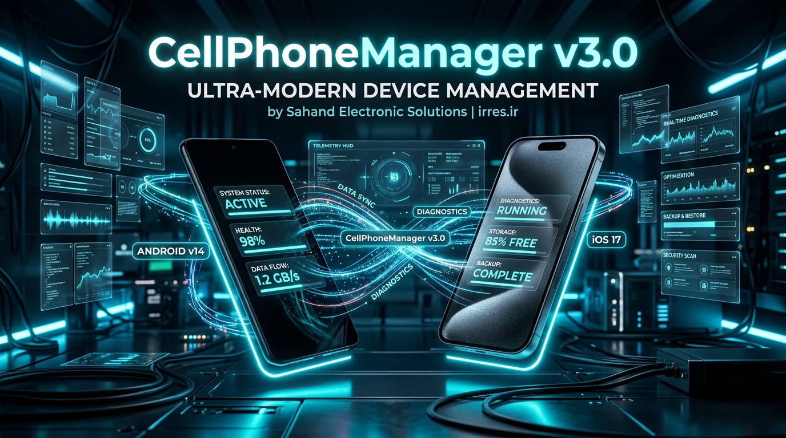

# 📱 CellPhoneManager v3.0 — Ultimate Smartphone Management Suite

[-00f0ff?style=for-the-badge&logo=android)](https://irres.ir)
[](https://github.com/taimazus/CellPhoneManager)
[](LICENSE)
[-blue?style=for-the-badge&logo=windows)](https://irres.ir)
[](https://irres.ir)

<div align="center">
  
  <p><em>Developed for <strong>Sahand Electronic Solutions Co.</strong> (<a href="https://irres.ir">https://irres.ir</a>)</em></p>
  <p><strong><a href="README.fa.md">🇮🇷 برای مشاهده راهنما به زبان فارسی اینجا کلیک کنید (Persian Documentation)</a></strong></p>
</div>

---

## 🌟 Overview

**CellPhoneManager v3.0** is an all-in-one, high-performance desktop control suite for **Android** and **iOS** devices. It seamlessly bridges desktop hardware with smartphone capabilities over wired USB or wireless Wi-Fi connections.

---

## 🗺️ System Architecture Diagram

```mermaid
graph TD
    A[CellPhoneManager v3.0] --> B[Device Control & Screen Mirroring]
    A --> C[Power & Root Studio]
    A --> D[Backup & Universal Restore]
    A --> E[Multimedia & Peripheral Bridge]
    A --> F[Network & VPN Tethering]
    A --> G[Security, Forensics & Passwords]

    B --> B1[In-Browser Live Stream]
    B --> B2[Scrcpy 60fps Ultra-Low Latency]
    B --> B3[Multi-Device Synchronized Fleet]

    C --> C1[Magisk 27+ / KernelSU Root]
    C --> C2[Temporary Fastboot Test Boot]
    C --> C3[1-Click Complete Unroot]
    C --> C4[Stock & Custom ROM Flasher]

    D --> D1[vCard 3.0 & JSON Full Backup]
    D --> D2[Cross-Platform Restore Android ⇄ iOS]
    D --> D3[APK Extractor & Direct PC Typing]

    E --> E1[4K Webcam for Zoom / OBS]
    E --> E2[Studio Microphone Streaming]
    E --> E3[Virtual Gamepad & PC Mouse]

    F --> F1[1-Click USB RNDIS Tethering]
    F --> F2[Phone VPN to Windows Proxy Tunnel]

    G --> G1[Saved Wi-Fi Passwords Viewer]
    G --> G2[Lockscreen Emergency Rescue & Wipe]
    G --> G3[APK Security Risk Scanner]
```



---

## 🚀 Easy Download & Installation from GitHub

### Method 1: Clone with Git (Recommended)
```bash
# 1. Clone the repository from GitHub
git clone https://github.com/taimazus/CellPhoneManager.git

# 2. Enter directory
cd CellPhoneManager

# 3. Run the smart auto-installer & launcher
start.bat
```

---

### Method 2: Download ZIP from GitHub Website
1. Visit **[github.com/taimazus/CellPhoneManager](https://github.com/taimazus/CellPhoneManager)**.
2. Click the green **Code** button and select **Download ZIP**.
3. Extract the downloaded `.zip` file.
4. Double-click **`start.bat`**.

> 💡 **Smart Launcher:** `start.bat` automatically verifies Node.js, installs dependencies, runs preflight diagnostics, and launches the app in your default browser at `http://localhost:5173`.

---

## 📱 Connecting Your Phone (3 Simple Steps)

### For Android Phones (Samsung, Xiaomi, Pixel, Huawei, etc.):
1. On your phone, go to **Settings** > **About Phone**.
2. Tap **Build Number** (or MIUI/HyperOS Version) **7 times** until "Developer mode is turned on" appears.
3. Go to **Settings** > **Developer Options** and enable **USB Debugging**.
4. Connect phone via USB cable and tap **Allow / Always Allow** on the phone screen.

### For Apple iPhone (iOS):
- Connect iPhone via cable and tap **Trust This Computer** on your phone screen.

---

## 🎯 Quick Feature Guide

| Module | What It Does |
|---|---|
| 🖥️ **Live Screen & Control** | Mirror and control your phone with mouse & keyboard at 60fps |
| 🌐 **VPN & Network Sharing** | Route PC applications (Discord, Telegram, Browsers) through active phone VPN |
| 📦 **Universal Backup** | 1-Click backup of Contacts, SMS, and Calls; restore across Android & iPhone |
| 🔑 **Password & Wi-Fi Vault** | View saved Wi-Fi passwords with 1-click clipboard copy and export |
| 📸 **4K Webcam Studio** | Use your phone camera as a crystal-clear webcam for OBS and Zoom |
| 🎙️ **Microphone Bridge** | Use phone microphone on PC for gaming, Discord, and streaming |
| 🔥 **Root & Unroot Studio** | Test root safely in RAM (`fastboot boot`) or 1-click unroot for banking apps |
| ⚡ **ROM Flasher Studio** | Flash official updates, LineageOS, PixelOS, or GSI partitions |
| 🗑️ **Debloater** | 1-Click removal of pre-installed bloatware apps |

---

## 🗑️ How to Completely Uninstall & Clean Up

To remove CellPhoneManager completely from your PC:
1. **Close the Application:** Press `Ctrl + C` in the launcher terminal or close the window.
2. **Stop ADB Background Daemon (Optional):** Open CMD and run:
   ```cmd
   taskkill /F /IM adb.exe
   ```
3. **Delete Folder:** Delete the `CellPhoneManager` folder. No background registry entries or hidden files remain on your system.

---

## 🏢 About Sahand Electronic Solutions
Developed by **Sahand Electronic Solutions Co.** (**شرکت راهکار الکترونیک سهند**).

- 🌐 **Website:** [https://irres.ir](https://irres.ir)
- 📍 **GitHub:** [https://github.com/taimazus/CellPhoneManager](https://github.com/taimazus/CellPhoneManager)
- ✉️ **Email:** [info@irres.ir](mailto:info@irres.ir)

---

## 📄 License
This project is licensed under the **MIT License** - see [LICENSE](LICENSE) for details.
