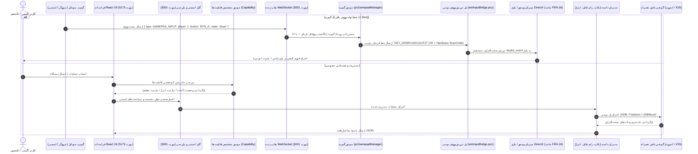

# 🏗️ مشخصات و ساختار معماری سامانه — CellPhoneManager v3.4.4 Royal Edition

  
<strong>شرکت راهکار الکترونیک سهند</strong> (Sahand Electronic Solutions Co.) — <a href="https://irres.ir">https://irres.ir</a>

  
<em>سند معماری جامع لایه‌ها، خطوط داده و ماژول‌های هسته سامانه</em>

  
<strong><a href="ARCHITECTURE.md">🇬🇧 For English Version Click Here</a></strong>

---

## ۱. توپولوژی سیستم و جریان داده (Data Flow)

---

## ۲. ماژول‌های معماری و مسئولیت‌های کلیدی

| نام ماژول | مسیر فایل | مسئولیت‌های اصلی |
| :--- | :--- | :--- |
| **`pcGamepadManager`** | `server/pcGamepadManager.js` | مدیریت ورودی‌های دسته بازی، نگاشت چندنفره (بازیکن ۱ و ۲)، پروفایل‌های بازی و هدایت وب‌سوکت. |
| **`winInputBridge`** | `server/winInputBridge.ps1` | فرآیند پایدار C# با تابع `keybd_event` برای تزریق مستقیم اسکن‌کد سخت‌افزاری مستقل از زبان کیبورد ویندوز. |
| **`capabilityManager`** | `server/capabilityManager.js` | ماتریس ۵ وضعیتی سنجش پیش‌نیازها، اعتبارسنجی نسخه سیستم‌عامل و ارائه راهنمای گام‌به‌گام. |
| **`securityManager`** | `server/securityManager.js` | مدیریت توکن‌های نشست، محدودسازی سرور به Localhost و ثبت دائمی لاگ‌های امنیتی در `audit_log.json`. |
| **`universalBackupManager`** | `server/universalBackupManager.js` | پشتیبان‌گیری رمزگذاری‌شده با کلید AES-256، استخراج مخاطبین و پیامک‌ها و جلوگیری از نفوذ Path Traversal. |
| **`taskQueueManager`** | `server/taskQueueManager.js` | صف اجرای همزمان وظایف چنددستگاهی با قابلیت توقف، ادامه و گزارش‌گیری. |
| **`telemetryManager`** | `server/telemetryManager.js` | ثبت سری‌های زمانی دما، ولتاژ باتری و فضای دیسک با هشدارهای خودکار داغ‌شدن. |
| **`profileManager`** | `server/profileManager.js` | پروفایل‌های آماده بهینه‌سازی (*Gaming Pro*, *Eco Power*, *Dev Studio*) و مقایسه تفاوت‌ها (Diff). |
| **`firmwareGuardManager`** | `server/firmwareGuardManager.js` | اعتبارسنجی هش SHA-256 و بررسی پارتیشن‌های هدف پیش از فلش فست‌بوت. |
| **`automationManager`** | `server/automationManager.js` | محرک‌های رویدادمحور اتصال USB و ثبت تاریخچه اجرای اتوماسیون‌ها. |
| **`toolManager`** | `server/toolManager.js` | موتور استقرار آفلاین (`bin/wheels/`)، بررسی سلامت ابزارها و دانلود شفاف کاتالوگ. |
| **`aiManager`** | `server/aiManager.js` | پردازش زبان طبیعی، اعمال گاردریل‌های ایمنی و اجرای فرامین سیستمی. |
| **`pcSpeakerManager`** | `server/pcSpeakerManager.js` | ضبط زنده صدای ویندوز و استریم کم‌تاخیر به همراه اکولایزر روی پروتکل WebAudio. |

---

## ۳. اصول و الزامات امنیتی سیستم

1. **استقلال کامل از زبان کیبورد (Hardware ScanCode Independence):** تزریق کلیدهای بازی صرفاً از طریق Scan Code سخت‌افزاری انجام شده و هیچ‌گونه وابستگی به چیدمان زبان فارسی یا انگلیسی ویندوز ندارد.
2. **محدودسازی به شبکه محلی و میزبان (Localhost Invariant):** تمامی APIها و وب‌سوکت‌ها بر روی `127.0.0.1` امن شده‌اند و ارتباط خارجی کنترل می‌شود.
3. **عدم الحاق رشته‌ای در دستورات (Zero Shell Injections):** کلیه فرامین ADB و Fastboot با آرایه‌های پارامتریک ایمن (`execFileAsync`) اجرا می‌شوند.
4. **استقلال کامل از اینترنت (Air-Gapped Ready):** تمامی ابزارها و درایورهای ضروری به صورت محلی در بسته نرم‌افزاری تعبیه شده‌اند.
