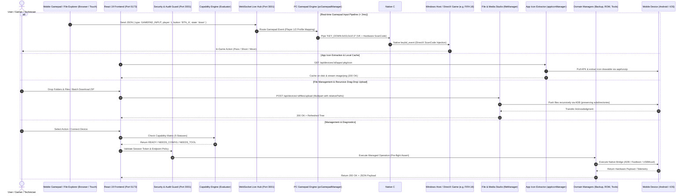

# 🏗️ CellPhoneManager v3.5.0 — Architectural Specifications

Developed exclusively for **Sahand Electronic Solutions Co. (شرکت راهکار الکترونیک سهند)** — [https://irres.ir](https://irres.ir).

---

## 1. System Topology & Data Flow

---

## 2. Core Architecture Modules & Responsibilities

| Module | Location | Primary Responsibilities |
| :--- | :--- | :--- |
| **`appIconManager`** | `server/appIconManager.js` | Direct APK icon extraction, local server file caching, MIME streaming, and SVG fallbacks. |
| **`fileManager`** | `server/fileManager.js` | Recursive file and folder push/pull, exact byte extraction (`sizeBytes`), human formatting, deletion, batch ZIP archiving, preview streaming. |
| **`pcGamepadManager`** | `server/pcGamepadManager.js` | Real-time multi-player gamepad mapping (Player 1 & 2), profiles (FIFA, Racing, Action, Retro), and WebSocket routing. |
| **`winInputBridge`** | `server/winInputBridge.ps1` | Persistent native C# `keybd_event` Windows hardware ScanCode injection bypassing Windows keyboard layout (FA/EN). |
| **`setupShortcut`** | `server/setupShortcut.js` | Automated Windows User PATH registration, `CPM_HOME` environment setup, and `.ico` desktop/start menu shortcut generation. |
| **`capabilityManager`** | `server/capabilityManager.js` | 5-state prerequisite matrix, OS version & permission validation, Persian guidance. |
| **`securityManager`** | `server/securityManager.js` | Session tokens, localhost binding enforcement, persistent audit logging. |
| **`universalBackupManager`** | `server/universalBackupManager.js` | AES-256 encrypted backups, vCard/JSON/SMS extraction, path-traversal prevention. |
| **`taskQueueManager`** | `server/taskQueueManager.js` | Multi-device concurrent task execution queue with pause/resume controls. |
| **`telemetryManager`** | `server/telemetryManager.js` | Time-series hardware telemetry (battery, temp, voltage, storage) and threshold alerts. |
| **`profileManager`** | `server/profileManager.js` | Device configuration presets (*Gaming Pro*, *Eco Power*, *Dev Studio*) & diff rollback. |
| **`firmwareGuardManager`** | `server/firmwareGuardManager.js` | SHA-256 image verification and fastboot pre-flash safety assertions. |
| **`automationManager`** | `server/automationManager.js` | Device connection event triggers and scheduled automation execution logs. |
| **`toolManager`** | `server/toolManager.js` | Offline wheels fallback (`bin/wheels/`), tool diagnosis, transparent downloads. |
| **`aiManager`** | `server/aiManager.js` | Intent parsing, guardrail enforcement, and direct device operation execution. |
| **`pcSpeakerManager`** | `server/pcSpeakerManager.js` | Windows loopback audio capture and ultra-low latency WebAudio streaming. |

---

## 3. Security & Input Invariants

1. **Hardware ScanCode Independence:** Gamepad keyboard injection relies strictly on PS/2 hardware scan codes (`scan`) and virtual keys (`vk`), completely isolating gameplay inputs from Windows active IME/keyboard layout (Persian vs English).
2. **Localhost Binding:** Express and WebSocket servers are bound strictly to `127.0.0.1` preventing unauthorized remote network access, with controlled LAN exposure only for mobile gamepad pairing.
3. **Zero Shell Injections:** Native tool execution uses `execFileAsync` argument vectors without raw shell string concatenation.
4. **Offline Invariant:** Core Android workflows operate with zero internet access; optional iOS tools utilize bundled wheels in `bin/wheels/`.
5. **Path Traversal Protection:** All file operations validate remote and local paths against illegal character injections or escaping directory boundaries.
