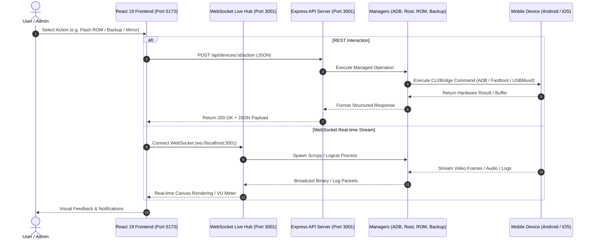
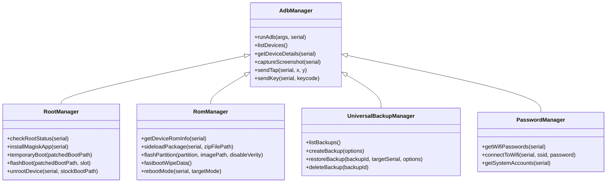

# 🏗️ CellPhoneManager v3.0 — Architectural Specifications

Developed for **Sahand Electronic Solutions Co.** ([https://irres.ir](https://irres.ir))

---

## 1. System Topology & Data Flow

---

## 2. Component Hierarchy & Module Mapping

---

## 3. Security Boundary & Permissions

- **Localhost Isolation:** Backend binds to `localhost:3001` with explicit CORS origin verification.
- **Input Sanitization:** Filename regex validation (`/[^a-zA-Z0-9._-]/g`) prevents path traversal.
- **Fail-Safe Fastboot Booting:** Temporary boot (`fastboot boot`) enables RAM-only kernel testing prior to permanent flash commits.
